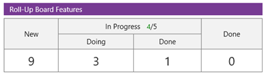
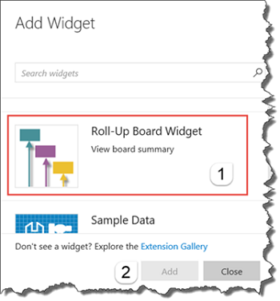
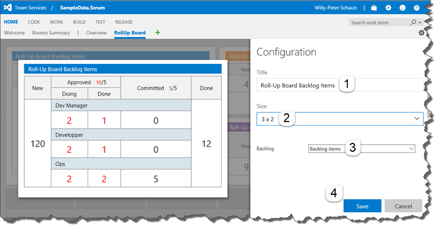
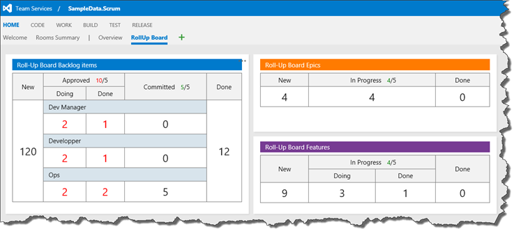

## Roll-up Board Widget ##

The **Roll-up Board Widget** displays an aggregated view of your backlog boards on your dashboards.

### Quick steps to get started ###

1. Edit  your dashboard.

2. Select the **Roll-up Board Widget** (1) and click Add (2).

    

3. Enter a Title (1), select a suitable Size (2), and select a Backlog (3). Click Save (4).

    

4. Add and arrange one or more of the widgets on your dashboard.

    

5. Click on the widget to take you to the associated board. 

### Known issue(s)
There is an oddity that occurs when a work item appears on several boards and has overlapping area path ownership between two or more teams. It’s a known limitation of Query on the Kanban board today and we therefore do **not** support overlapping area paths.

### Learn more

The [source](https://github.com/ALM-Rangers/Roll-Up-Board-Widget-Extension) to this extension is available. Feel free to take, fork, and extend.

[View Notices](https://marketplace.visualstudio.com/_apis/public/gallery/publisher/ms-devlabs/extension/RollUpBoard/latest/assetbyname/ThirdPartyNotices.txt) for third party software included in this extension.

> Microsoft DevLabs is an outlet for experiments from Microsoft, experiments that represent some of the latest ideas around developer tools. Solutions in this category are designed for broad usage, and you are encouraged to use and provide feedback on them; however, these extensions are not supported nor are any commitments made as to their longevity.

### Minimum supported environments ###
- Visual Studio Team Services
- Team Foundation Server 2015 Update 3 (or higher)

### Contributors ###
We thank the following contributor(s) for this extension: Mikael Krief.

### Feedback ###

We need your feedback! Here are some ways to connect with us:

- Add a review below.
- Send us an [email](mailto://mktdevlabs@microsoft.com).

Review the [list of features and resolved issues of latest tools and extensions](https://aka.ms/vsarreleases) for information on the latest releases.